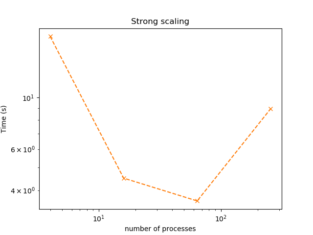
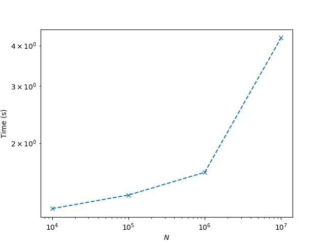

# Homework 6

- Yucheng Zhang

## 0. Final project update.

## 1. MPI-parallel two-dimensional Jacobi smoother.

- Weak scaling study
  - On Prince, we ask for `4` nodes and use option `-oversubscribe` to run MPI with tasks more than `4`.
  - The table and log-log plot below shows the timings with `10,000` runs and `Nl = 100` for different number of processes (tasks).

|     `np`     |   `4`    |   `16`   |   `64`   |   `256`   |
| :----------: | :------: | :------: | :------: | :-------: |
| `Timing (s)` | `0.2659` | `1.1611` | `5.5637` | `46.7728` |

- Strong scaling study
  - Same as weak scaling, we ask for `4` nodes and use option `-oversubscribe` to run MPI with tasks more than `4`.
  - We fix the problem size at `N = 4096` and increase the number of MPI tasks. The table and log-log plot below shows the timings with `10,000` runs.

|     `np`     |    `4`    |   `16`   |   `64`   |  `256`   |
| :----------: | :-------: | :------: | :------: | :------: |
| `Timing (s)` | `18.2533` | `4.5006` | `3.5988` | `8.9411` |

## 2. Parallel sample sort.

- We ask for `64` cores with `--nodes=4 --tasks-per-node=16 --cpus-per-task=1`. I tried `--nodes=64 --tasks-per-node=1` to make sure that data was transfered through network, but the job was killed by the Prince manager...

|    `N`     |   `10^4`   |   `10^5`   |   `10^6`   |   `10^7`   |
| :--------: | :--------: | :--------: | :--------: | :--------: |
| `Time (s)` | `1.255633` | `1.382723` | `1.625102` | `4.226203` |

