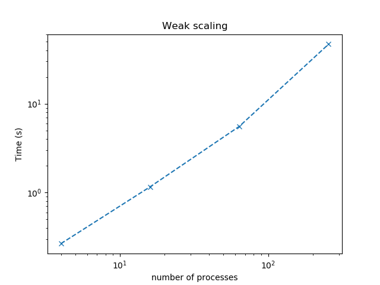

# Homework 6

- Yucheng Zhang

## 0. Final project update.

## 1. MPI-parallel two-dimensional Jacobi smoother.

- Weak scaling study
  - On Prince, we ask for `4` nodes and use option `-oversubscribe` to run MPI with tasks more than `4`.
  - The table below shows the timings with `10,000` runs and `Nl = 100` for different number of processes (tasks), which is plotted in .

|     `np`     |   `4`    |   `16`   |   `64`   |   `256`   |
| :----------: | :------: | :------: | :------: | :-------: |
| `Timing (s)` | `0.2659` | `1.1611` | `5.5637` | `46.7728` |

- Strong scaling study

## 2. Parallel sample sort.
